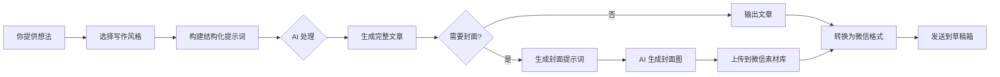

# 写作功能指南 (Writing Guide)

> 通过 `write_article` MCP 工具，只需提供一个想法，AI 就能自动生成符合特定创作者风格的文章。

## 概述

写作功能是 anbanwriter 的辅助写作工具，特点：

- **零基础友好**：只需一个观点或想法，AI 自动扩展成完整文章
- **创作者风格**：内置 Dan Koe 等风格，支持自定义
- **封面自动生成**：根据文章内容自动匹配封面提示词
- **AI 模式**：返回结构化提示词，由 Claude 等大模型生成内容

---

## 工具参数

### 输入类型

| 类型 | 参数 | 说明 | 示例 |
|------|------|------|------|
| **观点** | input_type="idea" | 一个观点或想法 | "我觉得自律是个伪命题" |
| **片段** | input_type="fragment" | 内容片段，需要润色扩展 | 现有的草稿或未完成的文章 |
| **大纲** | input_type="outline" | 文章大纲，需要填充内容 | 有结构，需要填充内容 |
| **标题** | input_type="title" | 仅标题，围绕标题写作 | "自律是个谎言" |

### 其他参数

| 参数 | 说明 |
|------|------|
| style | 写作风格（默认: dan-koe） |
| length | 文章长度：short/medium/long |
| title | 文章标题 |
| generate_cover | 同时生成封面提示词 |
| cover_only | 仅生成封面提示词 |

---

## 使用场景

### 场景 1：从零开始写文章

**输入**：一个想法或观点

调用 `write_article`，传入内容和风格参数。

**输出**：

- 完整的文章结构
- 丰富的内容扩展
- 精彩的金句
- 可选的封面提示词

### 场景 2：润色现有文章

调用 `write_article`，传入 input_type="fragment" 和文章内容。

### 场景 3：只生成封面

调用 `write_article`，传入 cover_only=true。

输入文章内容后，获得：

- 封面生成提示词
- 封面设计思路说明

---

## AI 模式说明

`write_article` 工具使用 **AI 模式**：

1. 工具返回结构化的提示词（JSON 格式）
2. 由 Claude 等大模型处理提示词
3. 生成最终文章内容

**在 Claude Code / OpenClaw 中使用时，这个流程是自动的。**

---

## 内置风格

### Dan Koe 风格

**特点**：

- 深刻但不晦涩
- 犀利但不刻薄
- 有哲学深度但接地气

**适合内容**：

- 个人成长类文章
- 观点评述
- 人生感悟
- 方法论分享

---

## 自定义风格

在 `writers/` 目录下创建 YAML 文件即可添加自定义风格：

```yaml
name: "我的风格"
english_name: "my-style"
description: "简洁有力"

writing_prompt: |
  你是一位简洁有力的写作者。
  用最少的字表达最清晰的观点。
  避免废话，直击要点。

cover_prompt: |
  为文章生成一个简洁有力的封面提示词。
  使用极简主义风格。

cover_style: "minimalist"
cover_mood: "professional"
cover_color_scheme: ["#000000", "#FFFFFF", "#FF0000"]
```

详细格式参考 `writers/dan-koe.yaml`。

---

## 完整工作流程



---

## 自然语言使用

在 Claude Code / OpenClaw 中，可以直接用自然语言：

```
"用 Dan Koe 风格写一篇关于 AI 时代程序员怎么搞钱的文章"
"帮我的文章润色一下，用更犀利的风格"
"生成一个匹配的封面"
```

Claude 会自动调用 `write_article` 工具并处理结果。

---

## 封面生成

### 封面尺寸建议

| 用途 | 尺寸格式 | 说明 |
|------|----------|------|
| **文章封面** | `16:9`（2K 档位） | 横向比例，在微信 feed 流和文章列表显示效果更好 |
| **小绿书/小红书** | `3:4`（2K）或 `3:4:1K` | 竖向比例 |

### 生成封面图

调用 `generate_image` MCP 工具，在 prompt 中指定 16:9 比例。

---

## 常见问题

**Q: 必须会写文章才能用吗？**

A: 不需要。写作功能专为小白设计，只需提供一个想法即可。

**Q: 生成的文章可以直接发公众号吗？**

A: 生成的是 Markdown 格式，需要调用 `convert_markdown` 工具转换为微信格式。

**Q: 可以修改生成的内容吗？**

A: 当然可以。生成的文章是起点，你可以直接修改 Markdown 文件。

**Q: 如何添加我喜欢的作家风格？**

A: 在 `writers/` 目录下创建 YAML 配置文件，格式参考 `writers/dan-koe.yaml`。

---

## 相关文档

- [writers/README.md](../../writers/README.md) - 自定义风格完整指南
